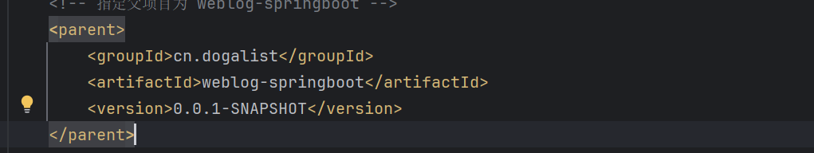

# Day1-Springboot项目初始化与配置

apiapi项目框架配置

在本项目中使用的开发环境：

* _JDK 1.8 版本_（此版本是目前企业中使用最广泛的）;
* _Springboot 2.6.3 版本_
* _MySQL 5.7 版本_ (或者 8.x 版本都可以，本项目使用的是 5.7 版本)；
* _Maven 3.8 版本_ （项目构建工具）;

## 多模块项目的起始

博客使用多模块结构进行编写，对于多模块项目，父目录和每个子目录都存在`pom.xml`文件，父目录下用于定义一些公用的插件和依赖管理，而子目录可以细分各个功能模块，并且按需加载插件与依赖

### 项目结构说明

该项目是一个多模块的 Maven 项目，主要包括以下模块以及文件：

* **weblog-springboot:** 父项目，定义了所有公共的依赖和插件管理，与多模块的结构。
* **weblog-web:** 前端展示模块，负责博客前台展示相关功能。
* **weblog-module-admin:** 管理后台模块。
* **weblog-module-common:** 公共模块，提供通用功能。
* **.gitignore:** 用于指定 Git 需要忽略的文件和目录。

<figure><figcaption><p>目录结构</p></figcaption></figure>

### 项目配置

#### 项目初始化

所有模块通过 `Spring Initializr` 进行初始化，在IDEA中新建项目中有内置的 `Spring Initializr` 支持初始化，可以直接使用

步骤如下：

* ①：选择 Spring Boot 项目初始化器；
* ②：填写父项目名称;
* ③：选择新建项目所在的位置；
* ④：选择通过 Maven 来构建项目；
* ⑤：填写 Group 组织名称，通常为域名倒写，例如我的项目中为 `cn.dogalist`；
* ⑥：选择前面小节中已经安装好的 JDK 1.8 版本；
* ⑦：选择 Java 版本，和 JDK 版本保持一致，选择 8；

> \==注意：==IDEA 通过 Spring Initializr 来创建 Spring Boot 项目，新版本不支持勾选 Java 8 了 ， 可以将初始化链接换成阿里云的 `http://start.aliyun.com`, 就可以正常选择 Java 8 了：

按照以上步骤初始化`weblog-springboot`文件夹后，再建立子模块`weblog-web`、`weblog-module-common`、`weblog-module-admin`，删除其中的无用文件夹，得到如下文件结构：

```
weblog-springboot/
├── .gitignore
├── README.md
├── pom.xml
├── weblog-web/
│   ├── .gitignore
│   ├── pom.xml
│   └── src/
│       ├── main/
│       │   ├── java/cn/dogalist/weblog/web/
│       │   │   └── WeblogWebApplication.java
│       │   └── resources/
│       │       └── application.yml
│       └── test/
│           └── java/cn/dogalist/weblog/web/
│               └── WeblogWebApplicationTests.java
├── weblog-module-admin/
│   ├── .gitignore
│   └── pom.xml
│   └── src/
│       └── test/
│           └── java/cn/dogalist/weblog/admin/
│               └── WeblogModuleAdminApplicationTests.java
└── weblog-module-common/
    ├── .gitignore
    └── pom.xml
    └── src/
        ├── main/
        │   └── java/cn/dogalist/weblog/common/
        └── test/
            └── java/cn/dogalist/weblog/common/
                └── WeblogModuleCommonApplicationTests.java
```

#### 模块配置

weblog-springboot（根目录）

* pom.xml

```xml
<?xml version="1.0" encoding="UTF-8"?>
<project xmlns="http://maven.apache.org/POM/4.0.0" xmlns:xsi="http://www.w3.org/2001/XMLSchema-instance"
         xsi:schemaLocation="http://maven.apache.org/POM/4.0.0 https://maven.apache.org/xsd/maven-4.0.0.xsd">
    <modelVersion>4.0.0</modelVersion>
    <groupId>cn.dogalist</groupId>
    <artifactId>weblog-springboot</artifactId>
    <version>0.0.1-SNAPSHOT</version>
    <name>weblog-springboot</name>
    <description>weblog-springboot</description>
    <!-- 多模块项目父工程打包模式必须指定为 pom -->
    <packaging>pom</packaging>
    <parent>
        <groupId>org.springframework.boot</groupId>
        <artifactId>spring-boot-starter-parent</artifactId>
        <!-- 将 Spring Boot 的版本号切换成 2.6 版本 -->
        <version>2.6.3</version>
        <relativePath/> <!-- lookup parent from repository -->
    </parent>
    <!-- 子模块管理 -->
    <modules>
        <module>weblog-web</module>
        <module>weblog-module-admin</module>
        <module>weblog-module-common</module>
    </modules>


    <!-- 版本号统一管理 -->
    <properties>
        <!-- 项目版本号 -->
        <revision>0.0.1-SNAPSHOT</revision>
        <java.version>1.8</java.version>
        <project.build.sourceEncoding>UTF-8</project.build.sourceEncoding>

        <!-- Maven 相关 -->
        <maven.compiler.source>${java.version}</maven.compiler.source>
        <maven.compiler.target>${java.version}</maven.compiler.target>

        <!-- 依赖包版本 -->
        <jackson.version>2.15.2</jackson.version>
        <lombok.version>1.18.28</lombok.version>
        <guava.version>31.1-jre</guava.version>
        <commons-lang3.version>3.12.0</commons-lang3.version>
    </properties>

    <!-- 统一依赖管理 -->
    <dependencyManagement>
        <dependencies>
            <dependency>
                <groupId>cn.dogalist</groupId>
                <artifactId>weblog-module-admin</artifactId>
                <version>${revision}</version>
            </dependency>

            <dependency>
                <groupId>cn.dogalist</groupId>
                <artifactId>weblog-module-common</artifactId>
                <version>${revision}</version>
            </dependency>

            <!-- 常用工具库 -->
            <dependency>
                <groupId>com.google.guava</groupId>
                <artifactId>guava</artifactId>
                <version>${guava.version}</version>
            </dependency>

            <dependency>
                <groupId>org.apache.commons</groupId>
                <artifactId>commons-lang3</artifactId>
                <version>${commons-lang3.version}</version>
            </dependency>

            <!-- Jackson -->
            <dependency>
                <groupId>com.fasterxml.jackson.core</groupId>
                <artifactId>jackson-databind</artifactId>
                <version>${jackson.version}</version>
            </dependency>

        </dependencies>
    </dependencyManagement>

    <build>
        <!-- 统一插件管理 -->
        <pluginManagement>
            <plugins>
                <plugin>
                    <groupId>org.springframework.boot</groupId>
                    <artifactId>spring-boot-maven-plugin</artifactId>
                    <configuration>
                        <excludes>
                            <exclude>
                                <groupId>org.projectlombok</groupId>
                                <artifactId>lombok</artifactId>
                            </exclude>
                        </excludes>
                    </configuration>
                </plugin>
            </plugins>
        </pluginManagement>
    </build>

    <!-- 使用阿里云的 Maven 仓库源，提升包下载速度 -->
    <repositories>
        <repository>
            <id>aliyunmaven</id>
            <name>aliyun</name>
            <url>https://maven.aliyun.com/repository/public</url>
        </repository>
    </repositories>

</project>

```

weblog-web

*   模块依赖：

    ​ 勾选上 `Lombok` 和 `Spring Web` 依赖
* pom.xml

```xml
<?xml version="1.0" encoding="UTF-8"?>
<project xmlns="http://maven.apache.org/POM/4.0.0" xmlns:xsi="http://www.w3.org/2001/XMLSchema-instance"
         xsi:schemaLocation="http://maven.apache.org/POM/4.0.0 https://maven.apache.org/xsd/maven-4.0.0.xsd">
    <modelVersion>4.0.0</modelVersion>
    <groupId>cn.dogalist</groupId>
    <artifactId>weblog-web</artifactId>
    <version>0.0.1-SNAPSHOT</version>
    <name>weblog-web</name>
    <description>weblog-web (入口项目，负责博客前台展示相关功能，打包也放在这个模块负责)</description>
    <!-- 指定父项目为 weblog-springboot -->
    <parent>
        <groupId>cn.dogalist</groupId>
        <artifactId>weblog-springboot</artifactId>
        <version>0.0.1-SNAPSHOT</version>
    </parent>
    <dependencies>
<!--    web依赖    -->
        <dependency>
            <groupId>org.springframework.boot</groupId>
            <artifactId>spring-boot-starter-web</artifactId>
        </dependency>
        <!-- 免写冗余的 Java 样板式代码 -->
        <dependency>
            <groupId>org.projectlombok</groupId>
            <artifactId>lombok</artifactId>
            <optional>true</optional>
        </dependency>
<!--        单元测试-->
        <dependency>
            <groupId>org.springframework.boot</groupId>
            <artifactId>spring-boot-starter-test</artifactId>
            <scope>test</scope>
        </dependency>

        <dependency>
            <groupId>cn.dogalist</groupId>
            <artifactId>weblog-module-common</artifactId>
        </dependency>

        <dependency>
            <groupId>cn.dogalist</groupId>
            <artifactId>weblog-module-admin</artifactId>
        </dependency>
    </dependencies>

    <build>
        <plugins>
            <plugin>
                <groupId>org.springframework.boot</groupId>
                <artifactId>spring-boot-maven-plugin</artifactId>
            </plugin>
        </plugins>
    </build>
</project>
```

weblog-module-admin

* pom.xml

```xml
<?xml version="1.0" encoding="UTF-8"?>
<project xmlns="http://maven.apache.org/POM/4.0.0" xmlns:xsi="http://www.w3.org/2001/XMLSchema-instance"
    xsi:schemaLocation="http://maven.apache.org/POM/4.0.0 https://maven.apache.org/xsd/maven-4.0.0.xsd">
    <modelVersion>4.0.0</modelVersion>
    <groupId>cn.dogalist</groupId>
    <artifactId>weblog-module-admin</artifactId>
    <version>0.0.1-SNAPSHOT</version>
    <name>weblog-module-admin</name>
    <description>weblog-module-admin (负责管理后台相关功能)</description>
    <parent>
        <groupId>cn.dogalist</groupId>
        <artifactId>weblog-springboot</artifactId>
        <version>0.0.1-SNAPSHOT</version>
    </parent>
    <dependencies>
        <dependency>
            <groupId>org.projectlombok</groupId>
            <artifactId>lombok</artifactId>
            <optional>true</optional>
        </dependency>
        <dependency>
            <groupId>org.springframework.boot</groupId>
            <artifactId>spring-boot-starter-test</artifactId>
            <scope>test</scope>
        </dependency>
        <dependency>
            <groupId>cn.dogalist</groupId>
            <artifactId>weblog-module-common</artifactId>
        </dependency>

    </dependencies>

</project>

```

weblog-module-common

* pom.xml

```xml
<?xml version="1.0" encoding="UTF-8"?>
<project xmlns="http://maven.apache.org/POM/4.0.0" xmlns:xsi="http://www.w3.org/2001/XMLSchema-instance"
         xsi:schemaLocation="http://maven.apache.org/POM/4.0.0 https://maven.apache.org/xsd/maven-4.0.0.xsd">
    <modelVersion>4.0.0</modelVersion>
    <groupId>cn.dogalist</groupId>
    <artifactId>weblog-module-common</artifactId>
    <version>0.0.1-SNAPSHOT</version>
    <name>weblog-module-common</name>
    <description>weblog-module-common</description>
    <parent>
        <groupId>cn.dogalist</groupId>
        <artifactId>weblog-springboot</artifactId>
        <version>0.0.1-SNAPSHOT</version>
    </parent>
    <dependencies>
        <!-- 免写冗余的 Java 样板式代码 -->
        <dependency>
            <groupId>org.projectlombok</groupId>
            <artifactId>lombok</artifactId>
            <optional>true</optional>
        </dependency>

        <!-- 常用工具库 -->
        <dependency>
            <groupId>com.google.guava</groupId>
            <artifactId>guava</artifactId>
        </dependency>

        <!-- 单元测试 -->
        <dependency>
            <groupId>org.springframework.boot</groupId>
            <artifactId>spring-boot-starter-test</artifactId>
            <scope>test</scope>
        </dependency>

        <!-- AOP 切面 -->
        <dependency>
            <groupId>org.springframework.boot</groupId>
            <artifactId>spring-boot-starter-aop</artifactId>
        </dependency>

        <!-- Jackson -->
        <dependency>
            <groupId>com.fasterxml.jackson.core</groupId>
            <artifactId>jackson-databind</artifactId>
        </dependency>

    </dependencies>

</project>

```

## AOP和日志模块整合

### 实现自定义注解

Java 注解是从 Java 5 开始引入的，它为我们提供了一种元编程的方法，允许我们在不改变代码逻辑的情况下为代码添加元数据。这些元数据可以在编译时或运行时通过反射被访问。而自定义注解是用户定义的，用于为代码提供元数据的注解。

在 `weblog-module-common` 通用模块下，新建一个名为 `aspect` 的包，用于放置切面相关的功能类，接着，在其中创建一个名为 `ApiOperationLog` 的自定义注解：

```java
package cn.dogalist.weblog.common.aspect;

import java.lang.annotation.*;

@Retention(RetentionPolicy.RUNTIME)
@Target({ElementType.METHOD})
@Documented
public @interface ApiOperationLog {
    /**
     * API 功能描述
     *
     * @return
     */
    String description() default "";
}

```

* `@Retention(RetentionPolicy.RUNTIME)`： 这个元注解用于指定注解的保留策略，即注解在何时生效。`RetentionPolicy.RUNTIME` 表示该注解将==在运行时保留==。
* `@Target({ElementType.METHOD})`： 这个元注解用于指定注解的目标元素，即可以在哪些地方使用这个注解。`ElementType.METHOD` 表示==该注解只能用于方法上==。
* `@Documented`：使用 `@Documented`，表示==在生成文档时，被注解的元素及其注解信息会被包含在文档中==。
*

### 什么是AOP

AOP（Aspect-Oriented Programming，面向切面编程）是一个编程范式，它提供了一种能力，让开发者能够模块化跨多个对象的横切关注点（例如日志、事务管理、安全等）。

主要概念包括：

* **切点 (Pointcuts)**: 定义在哪里应用切面（即在哪里插入横切关注点的代码）。
* **通知 (Advices)**: 定义在特定切点上要执行的代码。常见的通知类型有：前置通知、后置通知、环绕通知等。
* **切面 (Aspects)**: 切面将切点和通知结合起来，定义了在何处和何时应用特定的逻辑。

在面向切面编程（AOP）中，Pointcut是一个核心概念，它定义了程序执行过程中的哪些点（如方法调用、异常抛出等）是我们关注的。简单来说，Pointcut就是指定了我们希望在哪些地方应用切面（Aspect）。切面包含了前置通知（Before Advice）、后置通知（After Advice）、环绕通知（Around Advice）等。

`aspectj` 相关注解的作用：

* **@Aspect**：声明==该类为一个切面类==；
* **@Pointcut**：定义一个切点，后面跟随一个表达式，表达式==可以定义为切某个注解，也可以切某个 package 下的方法==；

切点定义好后，就是围绕这个切点做文章了：

* **@Before**: 在==切点之前，织入相关代码==；
* **@After**: 在==切点之后，织入相关代码==;
* **@AfterReturning**: 在==切点返回内容后，织入相关代码==，一般用于对返回值做些加工处理的场景；
* **@AfterThrowing**: 用来处理==当织入的代码抛出异常后的逻辑处理==;
* **@Around**: 环绕，可以在==切入点前后织入代码==，并且可以自由的控制何时执行切点；

### Pointcut的基本概念和用法

* **静态Pointcut**：基于类的结构信息来决定是否应用切面，例如所有公共方法、特定包下的所有类等。
* **动态Pointcut**：不仅依赖于静态结构信息，还可能依赖于运行时的信息，比如方法的参数值等。

#### 在Spring框架中使用Pointcut

Spring AOP使用了AspectJ的切点表达式语言，但只支持AspectJ的一部分功能。以下是一些常用的Pointcut表达式示例：

1.  **匹配特定的方法签名**

    ```java
    @Before("execution(public * com.example.service.MyService.*(..))")
    public void beforeMethod(JoinPoint joinPoint) {
        // 方法执行前的操作
    }
    ```

    这个例子表示，在`com.example.service.MyService`类中的任何公共方法执行之前，都会先执行`beforeMethod`方法。
2.  **匹配特定的参数**

    ```java
    @Before("execution(* com.example.service.MyService.find*(..)) && args(name)")
    public void beforeFindByName(JoinPoint joinPoint, String name) {
        // 方法执行前的操作
    }
    ```

    这里，只有当`find*`方法的参数为`name`时，才会触发`beforeFindByName`方法。
3.  **匹配特定的异常**

    ```java
    @AfterThrowing(pointcut="execution(* com.example.service.MyService.*(..))", throwing="ex")
    public void afterThrowing(JoinPoint joinPoint, Exception ex) {
        // 异常抛出后的操作
    }
    ```

    当`MyService`中的任意方法抛出异常时，会执行`afterThrowing`方法。
4.  **匹配多个条件**

    可以使用逻辑运算符`&&`（与）、`||`（或）、`!`（非）组合多个Pointcut条件。

    ```java
    @Before("execution(* com.example.service.MyService.*(..)) && !within(com.example.service.MyService+)")
    public void beforeMethodExceptSubclasses(JoinPoint joinPoint) {
        // 方法执行前的操作
    }
    ```

    这个例子表示除了`MyService`的子类之外的所有`MyService`方法执行前都会调用`beforeMethodExceptSubclasses`。

#### 创建自定义Pointcut

如果标准的Pointcut表达式不能满足需求，还可以创建自定义的Pointcut。这通常涉及到实现Spring的`org.aspectj.lang.annotation.Pointcut`注解，并定义自己的逻辑来确定何时应该应用切面。

```java
@Pointcut("execution(* com.example.service.MyService.*(..))")
public void myServiceMethods() {}

@Before("myServiceMethods()")
public void beforeMyServiceMethods(JoinPoint joinPoint) {
    // 方法执行前的操作
}
```

这里，`myServiceMethods`是一个自定义的Pointcut，它定义了所有`MyService`类的方法。然后，`beforeMyServiceMethods`会在这些方法执行前被调用。

### 使用AOP添加日志逻辑

在我们的项目中，使用AOP，我们可以为所有使用 `@ApiOperationLog` 注解的方法自动添加日志逻辑，而不需要在每个方法中手动添加。

#### 配置日志模块Logback

Logback 是日志框架 SLF4J 的一个实现，它被设计用来替代 `log4j`。Logback 提供了更高的性能，更丰富的日志功能和更好的配置选项。

在 `src/main/resources` 目录下，创建一个名为 `logback-weblog.xml` 的文件，这是Logback的配置文件。

```xml
<?xml version="1.0" encoding="UTF-8"?>
<configuration >
    <jmxConfigurator/>
    <include resource="org/springframework/boot/logging/logback/defaults.xml" />

    <!-- 应用名称 -->
    <property scope="context" name="appName" value="weblog" />
    <!-- 自定义日志输出路径，以及日志名称前缀 -->
<!--   日志文件存储地址linux格式: /app/weblog/logs/${appName}.%d{yyyy-MM-dd}
       测试时使用的windows格式（按自己的地址填）： E:\\work\\java\\weblog\\logs\\${appName}.%d{yyyy-MM-dd}
-->
    <property name="LOG_FILE" value="/app/weblog/logs/${appName}.%d{yyyy-MM-dd}"/>
    <property name="FILE_LOG_PATTERN" value="%d{yyyy-MM-dd HH:mm:ss.SSS} [%thread] %-5level %logger{50} - %msg%n"/>
    <!--<property name="CONSOLE_LOG_PATTERN" value="${FILE_LOG_PATTERN}"/>-->

    <!-- 按照每天生成日志文件 -->
    <appender name="FILE" class="ch.qos.logback.core.rolling.RollingFileAppender">
        <rollingPolicy class="ch.qos.logback.core.rolling.TimeBasedRollingPolicy">
            <!-- 日志文件输出的文件名 -->
            <FileNamePattern>${LOG_FILE}-%i.log</FileNamePattern>
            <!-- 日志文件保留天数 -->
            <MaxHistory>30</MaxHistory>
            <!-- 日志文件最大的大小 -->
            <TimeBasedFileNamingAndTriggeringPolicy class="ch.qos.logback.core.rolling.SizeAndTimeBasedFNATP">
                <maxFileSize>10MB</maxFileSize>
            </TimeBasedFileNamingAndTriggeringPolicy>
        </rollingPolicy>
        <encoder class="ch.qos.logback.classic.encoder.PatternLayoutEncoder">
            <!-- 格式化输出：%d 表示日期，%thread 表示线程名，%-5level：级别从左显示 5 个字符宽度 %errorMessage：日志消息，%n 是换行符-->
            <pattern>${FILE_LOG_PATTERN}</pattern>
        </encoder>
    </appender>

    <!-- dev 环境（仅输出到控制台） -->
    <springProfile name="dev">
        <include resource="org/springframework/boot/logging/logback/console-appender.xml" />
        <root level="info">
            <appender-ref ref="CONSOLE" />
        </root>
    </springProfile>

    <!-- prod 环境（仅输出到文件中） -->
    <springProfile name="prod">
        <include resource="org/springframework/boot/logging/logback/console-appender.xml" />
        <root level="INFO">
            <appender-ref ref="FILE" />
        </root>
    </springProfile>
</configuration>
```

#### 创建 JSON 工具类

在 `weblog-module-common` 通用模块下，创建一个 `utils` 包，用于统一放置工具类相关，然后，新建一个名为 `JsonUtil` 的工具类， 代码如下：

```java
package cn.dogalist.weblog.common.utils;

import com.fasterxml.jackson.core.JsonProcessingException;
import com.fasterxml.jackson.databind.ObjectMapper;
import lombok.extern.slf4j.Slf4j;

/*
 * @author: monthwolf
 * @url: dogalist.cn
 * @date: 2024-10-21
 * @description: JSON 工具类， toJsonString 方法，用于将传入的对象打印成 JSON 字符串
 */

@Slf4j
public class JsonUtil {
    private static final ObjectMapper INSTANCE = new ObjectMapper();

    public static String toJsonString(Object obj) {
        try {
            return INSTANCE.writeValueAsString(obj);
        } catch (JsonProcessingException e){
            return obj.toString();
        }
    }
}
```

#### 定义日志切面类

工具类搞定后，在 `aspect` 包下，新建切面类 `ApiOperationLogAspect`

```java
package cn.dogalist.weblog.common.aspect;

import cn.dogalist.weblog.common.utils.JsonUtil;
import lombok.extern.slf4j.Slf4j;
import org.aspectj.lang.ProceedingJoinPoint;
import org.aspectj.lang.annotation.Around;
import org.aspectj.lang.annotation.Aspect;
import org.aspectj.lang.annotation.Pointcut;
import org.aspectj.lang.reflect.MethodSignature;
import org.slf4j.MDC;
import org.springframework.stereotype.Component;

import java.lang.reflect.Method;
import java.util.Arrays;
import java.util.UUID;
import java.util.function.Function;
import java.util.stream.Collectors;


@Aspect // 声明这是一个切面
@Component // 声明这是一个Spring Bean
@Slf4j // 日志
public class ApiOperationLogAspect {
    /** 以自定义 @ApiOperationLog 注解为切点，凡是添加 @ApiOperationLog 的方法，都会执行环绕中的代码 */
    @Pointcut("@annotation(cn.dogalist.weblog.common.aspect.ApiOperationLog)")
    public void apiOperationLog() {}

    /**
     * 环绕
     * @param joinPoint
     * @return
     * @throws Throwable
     */
    @Around("apiOperationLog()")
    public Object doAround(ProceedingJoinPoint joinPoint) throws Throwable {
        try {
            //请求开始实践
            long startTime = System.currentTimeMillis();

            //MDC
            MDC.put("traceId", UUID.randomUUID().toString());

            // 获取被请求的类和方法名
            String className = joinPoint.getTarget().getClass().getSimpleName();
            String methodName = joinPoint.getSignature().getName();

            // 请求入参
            Object[] args = joinPoint.getArgs();
            // 入参转JSON
            String argsJsonStr = Arrays.stream(args).map(toJsonStr()).collect(Collectors.joining(", "));

            // 功能描述
            String description = getApiOperationLogDescription(joinPoint);

            // 打印请求参数
            log.info("====== 请求开始: [{}], 入参: {}, 请求类: {}, 请求方法: {} =================================== ",
                    description, argsJsonStr, className, methodName);

            // 执行切点方法
            Object result = joinPoint.proceed();

            // 请求耗时
            long executionTime = System.currentTimeMillis() - startTime;
            // 打印请求结果
            log.info("====== 请求结束: [{}], 出参: {}, 请求耗时: {} =================================== ",description, JsonUtil.toJsonString(result), executionTime);
            return result;
        } finally {
            // 清除日志上下文
            MDC.clear();
        }
    }

    /**
     * 获取注解的描述信息
     * @param joinPoint
     * @return
     */
    private String getApiOperationLogDescription(ProceedingJoinPoint joinPoint) {
        // ①从 ProceedingJoinPoint 获取 MethodSignature（方法签名）
        MethodSignature methodSignature = (MethodSignature) joinPoint.getSignature();
        // ②从 MethodSignature 获取 Method（方法对象）
        Method method = methodSignature.getMethod();
        // ③从 Method 获取注解
        ApiOperationLog apiOperationLog = method.getAnnotation(ApiOperationLog.class);
        // ④获取注解的描述信息
        return apiOperationLog.description();
    }


    /**
     * 转 JSON 字符串
     * @return
     */
    private Function<Object, String> toJsonStr() {
        return arg -> JsonUtil.toJsonString(arg);
    }

}
```

#### 添加包扫描

在启动类 `WeblogWebApplication` 中，手动添加包扫描 `@ComponentScan` , 指定扫描 `cn.dogalist.weblog` 包下面的所有类:

```java
package cn.dogalist.weblog.web;

import org.springframework.boot.SpringApplication;
import org.springframework.boot.autoconfigure.SpringBootApplication; 
import org.springframework.context.annotation.ComponentScan; //添加

@SpringBootApplication
@ComponentScan({"cn.dogalist.weblog.*"}) //添加该内容，多模块必须手动指定扫描
public class WeblogWebApplication {

    public static void main(String[] args) {

        SpringApplication.run(WeblogWebApplication.class, args);
    }

}
```

### 环境区分和日志测试


#### 环境划分

如上面文件结构，在`weblog-web` 的`resoureces`文件下创建`application.yml`配置文件，`application.yml`中定义选择的环境

```yml
spring:
  profiles:
    # 默认激活 dev 环境
    active: dev
```

对应的激活环境配置则与`application-{active}.yml`配置的内容相同，可以通过定义不同的`application-*.yml`文件创建不同的配置，在这个项目中只定义了测试环境和生产环境

#### 日志测试

如上面文件结构，在`weblog-web` 下创建`controller`包和`model`包，分别在两个包中新建类`TestController`和`User`类

* `TestController`类

```java
package cn.dogalist.weblog.web.controller;

import cn.dogalist.weblog.common.aspect.ApiOperationLog;
import cn.dogalist.weblog.web.model.User;
import lombok.extern.slf4j.Slf4j;
import org.springframework.web.bind.annotation.PostMapping;
import org.springframework.web.bind.annotation.RequestBody;
import org.springframework.web.bind.annotation.RestController;

@RestController
@Slf4j
public class TestController {
    @PostMapping("/test")
    @ApiOperationLog(description = "测试接口")
    public User test(@RequestBody User user) {
        return user;
    }
}
```

* `User`类

```java
package cn.dogalist.weblog.web.model;

import lombok.Data;

@Data
public class User {
    private String username;
    private Integer sex;
}
```

添加完成后，运行`WeblogWebApplication`文件，同时使用api测试工具发送POST请求到`localhost:8080/test`，携带请求参数如下：

```json
{
    "username": "admin",
    "sex": 1
}
```

api请求正常：


成功得到日志信息：


