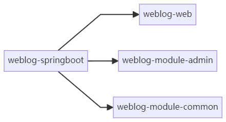

# 1.项目创建与依赖配置

## <mark style="color:blue;">使用版本</mark>

项目使用maven构建springboot项目，使用java8和springboot2.6.3版本以及最新的maven3.9.2

### <mark style="color:blue;">多模块项目的起始</mark>

博客使用多模块结构进行编写，对于多模块项目，父目录和每个子目录都存在`pom.xml`文件，父目录下用于定义一些公用的插件和依赖信息

> pluginManagement 元素与 dependencyManagement 元素的原理十分相似，在 pluginManagement 元素中可以声明插件及插件配置，但不会发生实际的插件调用行为，只有在 POM 中配置了真正的 plugin 元素，且其 groupId 和 artifactId 与 pluginManagement 元素中配置的插件匹配时，pluginManagement 元素的配置才会影响到实际的插件行为。
>
> 原文链接：https://blog.csdn.net/feiying0canglang/article/details/129201139


项目中子模块需要指定`parent` 以适配版本信息等内容

<figure><figcaption><p>子模块weblog-web中指定parent信息</p></figcaption></figure>

父目录**weblog-springboo**t的`pom.xml`

```xml
<?xml version="1.0" encoding="UTF-8"?>
<project xmlns="http://maven.apache.org/POM/4.0.0" xmlns:xsi="http://www.w3.org/2001/XMLSchema-instance"
         xsi:schemaLocation="http://maven.apache.org/POM/4.0.0 https://maven.apache.org/xsd/maven-4.0.0.xsd">
    <modelVersion>4.0.0</modelVersion>
    <groupId>cn.dogalist</groupId>
    <artifactId>weblog-springboot</artifactId>
    <version>0.0.1-SNAPSHOT</version>
    <name>weblog-springboot</name>
    <description>weblog-springboot</description>
    <!-- 多模块项目父工程打包模式必须指定为 pom -->
    <packaging>pom</packaging>
    <parent>
        <groupId>org.springframework.boot</groupId>
        <artifactId>spring-boot-starter-parent</artifactId>
        <!-- 将 Spring Boot 的版本号切换成 2.6 版本 -->
        <version>2.6.3</version>
        <relativePath/> <!-- lookup parent from repository -->
    </parent>
    <!-- 子模块管理 -->
    <modules>
        <module>weblog-web</module>
    </modules>


    <!-- 版本号统一管理 -->
    <properties>
        <!-- 项目版本号 -->
        <revision>0.0.1-SNAPSHOT</revision>
        <java.version>1.8</java.version>
        <project.build.sourceEncoding>UTF-8</project.build.sourceEncoding>

        <!-- Maven 相关 -->
        <maven.compiler.source>${java.version}</maven.compiler.source>
        <maven.compiler.target>${java.version}</maven.compiler.target>

    </properties>

    <!-- 统一依赖管理 -->
    <dependencyManagement>

    </dependencyManagement>

    <build>
        <!-- 统一插件管理 -->
        <pluginManagement>
            <plugins>
                <plugin>
                    <groupId>org.springframework.boot</groupId>
                    <artifactId>spring-boot-maven-plugin</artifactId>
                    <configuration>
                        <excludes>
                            <exclude>
                                <groupId>org.projectlombok</groupId>
                                <artifactId>lombok</artifactId>
                            </exclude>
                        </excludes>
                    </configuration>
                </plugin>
            </plugins>
        </pluginManagement>
    </build>

    <!-- 使用阿里云的 Maven 仓库源，提升包下载速度 -->
    <repositories>
        <repository>
            <id>aliyunmaven</id>
            <name>aliyun</name>
            <url>https://maven.aliyun.com/repository/public</url>
        </repository>
    </repositories>

</project>

```

子目录**weblog-web**的`pom.xml`

```xml
<?xml version="1.0" encoding="UTF-8"?>
<project xmlns="http://maven.apache.org/POM/4.0.0" xmlns:xsi="http://www.w3.org/2001/XMLSchema-instance"
         xsi:schemaLocation="http://maven.apache.org/POM/4.0.0 https://maven.apache.org/xsd/maven-4.0.0.xsd">
    <modelVersion>4.0.0</modelVersion>
    <groupId>cn.dogalist</groupId>
    <artifactId>weblog-web</artifactId>
    <version>0.0.1-SNAPSHOT</version>
    <name>weblog-web</name>
    <description>weblog-web (入口项目，负责博客前台展示相关功能，打包也放在这个模块负责)</description>
    <!-- 指定父项目为 weblog-springboot -->
    <parent>
        <groupId>cn.dogalist</groupId>
        <artifactId>weblog-springboot</artifactId>
        <version>0.0.1-SNAPSHOT</version>
    </parent>
    <dependencies>
<!--    web依赖    -->
        <dependency>
            <groupId>org.springframework.boot</groupId>
            <artifactId>spring-boot-starter-web</artifactId>
        </dependency>
        <!-- 免写冗余的 Java 样板式代码 -->
        <dependency>
            <groupId>org.projectlombok</groupId>
            <artifactId>lombok</artifactId>
            <optional>true</optional>
        </dependency>
<!--        单元测试-->
        <dependency>
            <groupId>org.springframework.boot</groupId>
            <artifactId>spring-boot-starter-test</artifactId>
            <scope>test</scope>
        </dependency>
    </dependencies>

    <build>
        <plugins>
            <plugin>
                <groupId>org.springframework.boot</groupId>
                <artifactId>spring-boot-maven-plugin</artifactId>
            </plugin>
        </plugins>
    </build>
</project>

```

