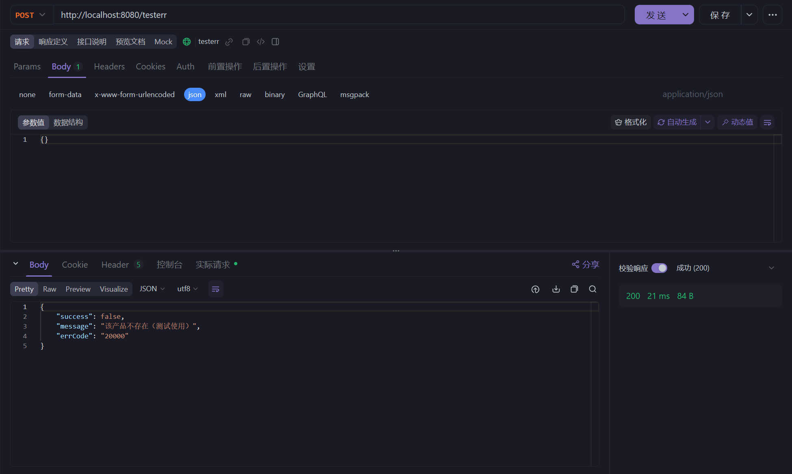
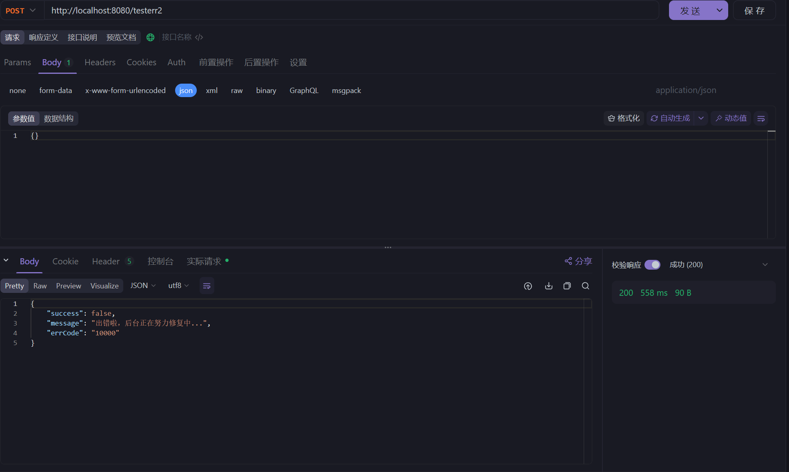

# Day3-响应和异常处理以及API文档构建

## 响应 Json 化

### 格式定义

在前后端分离项目中，前端和后端一般都是以 JSON 格式进行数据交互。在本项目中，请求格式如下：

* 接口执行成功返参格式

```json
{
	"success": true,
	"data": null
}
```

​ `success` : 是否请求成功，布尔型，`true` 表示接口请求成功，`false` 表示执行失败；

​ `data` : 服务端响应数据，对象类型；

* 接口执行异常返参格式

```json
{
	"success": false,
	"errorCode": "10000",
	"message": "用户名不能为空"
}
```

​ `message`: 服务端响应消息，字符串类型，当 `success` 为 `false` 时，此字段才会不为空，用于后端返回失败的原因，方便前端弹出提示消息；

​ `errorCode`: 异常码，字符串类型，微服务中用的比较多，通常格式为服务的唯一标识 + 异常码进行返回，如 `QMS100000`, 这样做的好处是，当发生问题时，用于快速锁定是链路上的哪个服务出现了问题。

### 响应类的构建

在 `weblog-module-common` 模块的 `utils` 包中新建 `Response` 类，定义如下：

```java
package cn.dogalist.weblog.common.utils;

import java.io.Serializable;
import lombok.Data;

@Data
public class Response<T> implements Serializable {
    private boolean success = true;
    private String message;
    private String errCode;
    private T data;

    // =================== 成功 =====================
    public static <T> Response<T> success(){
        Response<T> response = new Response<>();
        return response;
    }
    public static <T> Response<T> success(T data) {
        Response<T> response = new Response<>();
        response.setData(data);
        return response;
    }

    // =================== 失败 =====================
    public static <T> Response<T> fail() {
        Response<T> response = new Response<>();
        response.setSuccess(false);
        return response;
    }
    public static <T> Response<T> fail(String errMsg) {
        Response<T> response = new Response<>();
        response.setSuccess(false);
        response.setMessage(errMsg);
        return response;
    }
    public static <T> Response<T> fail(String errCode, String errMsg) {
        Response<T> response = new Response<>();
        response.setSuccess(false);
        response.setMessage(errMsg);
        response.setErrCode(errCode);
        return response;
    }

}
```

### 在测试中使用

在之前的测试类 `TestController` 中重新定义响应：

```java
package cn.dogalist.weblog.web.controller;

import cn.dogalist.weblog.common.aspect.ApiOperationLog;
import cn.dogalist.weblog.common.utils.Response;
import cn.dogalist.weblog.web.model.User;
import lombok.extern.slf4j.Slf4j;
import org.springframework.validation.BindingResult;
import org.springframework.validation.FieldError;
import org.springframework.validation.annotation.Validated;
import org.springframework.web.bind.annotation.PostMapping;
import org.springframework.web.bind.annotation.RequestBody;
import org.springframework.web.bind.annotation.RestController;
import java.util.stream.Collectors;

@RestController
@Slf4j
public class TestController {
    @PostMapping("/test")
    @ApiOperationLog(description = "测试接口")
    public Response test(@RequestBody @Validated User user, BindingResult bindingResult) {
        // 是否存在校检错误
        if (bindingResult.hasErrors()) {
            String errorMsg = bindingResult.getFieldErrors()
                    .stream()
                    .map(FieldError::getDefaultMessage)
                    .collect(Collectors.joining(", "));
            return Response.fail(errorMsg);
        }

        return Response.success();
    }
}
```

再次运行 Web 应用，并在 api 测试工具中重新进行请求，可见得到的结果已经 Json 化了：


## Jackson 美化响应输出

### Jackson 介绍

在 Spring 框架中，`Jackson` 是一个常用的库，用于在 Java 对象和 JSON 之间进行序列化和反序列化。

在 Spring Web 应用程序中配置 Jackson 通常涉及以下几个步骤：

1. 添加依赖

首先，确保在你的 `pom.xml`（Maven）或 `build.gradle`（Gradle）中添加了 Jackson 的依赖。

对于 Maven：

```xml
<dependencies>
    <!-- Jackson核心库 -->
    <dependency>
        <groupId>com.fasterxml.jackson.core</groupId>
        <artifactId>jackson-databind</artifactId>
        <version>2.13.0</version>
    </dependency>
    <!-- 为了支持Java 8日期/时间类型 -->
    <dependency>
        <groupId>com.fasterxml.jackson.datatype</groupId>
        <artifactId>jackson-datatype-jsr310</artifactId>
        <version>2.13.0</version>
    </dependency>
</dependencies>
```

对于 Gradle：

```groovy
dependencies {
    implementation 'com.fasterxml.jackson.core:jackson-databind:2.13.0'
    implementation 'com.fasterxml.jackson.datatype:jackson-datatype-jsr310:2.13.0'
}
```

2. 配置HttpMessageConverters

在Spring MVC中，你可以通过配置`HttpMessageConverters`来集成Jackson。

```java
@Configuration
public class WebConfig implements WebMvcConfigurer {

    @Override
    public void extendMessageConverters(List <HttpMessageConverter<?> > converters) {
        // 添加或自定义 Jackson 的 HttpMessageConverter
        MappingJackson2HttpMessageConverter converter = new MappingJackson2HttpMessageConverter();
        // 可以设置自定义的 ObjectMapper
        converter.setObjectMapper(yourCustomObjectMapper());
        // 添加到转换器列表中
        converters.add(0, converter); // 添加到首位以确保优先使用
    }

    public ObjectMapper yourCustomObjectMapper() {
        ObjectMapper objectMapper = new ObjectMapper();
        // 配置 ObjectMapper，例如日期格式、时区等
        objectMapper.configure(SerializationFeature.WRITE_DATES_AS_TIMESTAMPS, false);
        objectMapper.registerModule(new JavaTimeModule());
        // 更多配置...
        return objectMapper;
    }
}
```

3. 配置ObjectMapper

你可以通过`ObjectMapper`设置各种序列化和反序列化的特性。

```java
public ObjectMapper yourCustomObjectMapper() {
    ObjectMapper objectMapper = new ObjectMapper();

    // 禁用将日期转换为时间戳
    objectMapper.disable(SerializationFeature.WRITE_DATES_AS_TIMESTAMPS);

    // 启用或禁用各种特性
    objectMapper.enable(MapperFeature.USE_ANNOTATIONS);

    // 配置日期格式
    SimpleDateFormat dateFormat = new SimpleDateFormat(" yyyy-MM-dd HH:mm:ss ");
    objectMapper.setDateFormat(dateFormat);

    // 注册模块，例如 Java 8 日期/时间支持
    objectMapper.registerModule(new JavaTimeModule());

    // 配置模块，例如 Joda-Time 支持
    // objectMapper.registerModule(new JodaModule());

    // 设置时区
    objectMapper.setTimeZone(TimeZone.getTimeZone("Asia/Shanghai"));

    // 配置自定义序列化器和反序列化器
    // objectMapper.serializerByType(...);
    // objectMapper.deserializerByType(...);

    // 更多配置...
    return objectMapper;
}
```

4. 使用注解

在实体类上使用Jackson提供的注解来定制序列化和反序列化行为。

```java
public class User {
    // ...

    @JsonProperty("user_name")
    private String name;

    @JsonFormat(shape = JsonFormat.Shape.STRING, pattern = "yyyy-MM-dd")
    private LocalDate birthDate;

    // ...
}
```

### Jackson的配置

在Spring Boot应用程序中，可以通过`application.yml`文件来配置Jackson的某些特性，而不是在Java代码中进行配置。以下是一些可以在`application.yml`文件中配置的Jackson属性及其说明：

```yml
spring:
  jackson:
    # 配置日期格式
    date-format: yyyy-MM-dd HH:mm:ss
    # 配置时区
    time-zone: Asia/Shanghai
    # 禁用将日期转换为时间戳
    serialization:
      write-dates-as-timestamps: false
    # 配置 JSON 生成特性
    generator:
      # 是否在 JSON 中包含属性名称
      write-null-map-values: false
      # 是否美化输出（格式化 JSON）
      pretty-print: true
    # 配置 JSON 解析特性
    parser:
      # 是否允许解析使用单引号的属性名称
      allow-single-quotes: true
    # 配置模块
    modules:
      # 启用或禁用 Java 8 日期/时间支持模块
      - name: java.time
        # true 表示启用，false 表示禁用
        enabled: true
    # 配置默认属性包含行为
    default-property-inclusion: non_null
    # 配置属性命名策略
    property-naming-strategy: SNAKE_CASE
    # 配置注解的可见性
    visibility:
      # 设置 getter 方法的可见性阈值
      getter: public
      # 设置 setter 方法的可见性阈值
      setter: public
      # 设置 creator 方法的可见性阈值（构造函数/工厂方法）
      creator: public
      # 设置字段可见性阈值
      field: public
```

#### date-format

* **用途**：指定日期和时间的格式。
* **默认值**：ISO日期格式。
* **示例**：`yyyy-MM-dd HH:mm:ss`。
* **解释**：当你的 Java 对象包含日期或时间类型的属性时，这个格式将用于序列化这些属性到 JSON 字符串。确保这个格式符合你的需求。

#### time-zone

* **用途**：指定日期和时间操作时使用的时区。
* **默认值**：UTC。
* **示例**：`Asia/Shanghai`。
* **解释**：这个配置确保了在序列化和反序列化日期/时间时，使用的是正确的时区。

#### serialization.write-dates-as-timestamps

* **用途**：控制日期和时间是否以时间戳的形式序列化。
* **默认值**：`true`。
* **示例**：`false`。
* **解释**：如果设置为 `true`，则日期和时间会被序列化为从 1970 年 1 月 1 日 UTC 开始计算的毫秒数。如果设置为 `false`，则日期和时间将按照 `date-format` 指定的格式进行序列化。

#### generator.write-null-map-values

* **用途**：控制是否序列化值为 null 的 Map 条目。
* **默认值**：`true`。
* **示例**：`false`。
* **解释**：如果设置为 `false`，则在序列化 Map 时，值为 null 的条目将不会被包含在 JSON 中。

#### generator.pretty-print

* **用途**：控制是否以美化（格式化）的方式输出 JSON。
* **默认值**：`false`。
* **示例**：`true`。
* **解释**：如果设置为 `true`，则生成的 JSON 字符串将具有缩进和换行，便于阅读。

#### parser.allow-single-quotes

* **用途**：控制是否允许 JSON 字符串使用单引号作为属性名称的界定符。
* **默认值**：`false`。
* **示例**：`true`。
* **解释**：如果设置为 `true`，则解析器将接受单引号定义的属性名称，这在某些非标准 JSON 格式中可能很有用。

#### modules

* **用途**：配置 Jackson 模块，以启用或禁用特定功能。
* **示例**：`- name: java.time enabled: true`。
* **解释**：这里可以配置各种 Jackson 模块，例如 `java.time` 模块，它提供了对 Java 8 日期和时间 API 的支持。通过设置 `enabled` 为 `true` 或 `false`，可以启用或禁用模块。

#### default-property-inclusion

* **用途**：指定默认的属性包含行为。
* **示例**：`non_null`。
* **解释**：这定义了在序列化时默认包含哪些属性。`non_null` 表示只包含非 null 属性。其他选项包括 `always`（总是包含所有属性），`non_absent`（不包含 null 和 absent 值），`non_default`（不包含默认值），`non_empty`（不包含空集合或数组）。

#### property-naming-strategy

* **用途**：指定属性命名策略。
* **示例**：`SNAKE_CASE`。
* **解释**：这定义了如何将 Java 属性名转换为 JSON 属性名。`SNAKE_CASE` 表示使用蛇形命名法（例如 `user_name`）。其他选项包括 `UPPER_CAMEL_CASE`，`LOWER_CAMEL_CASE` 等。

#### visibility

* **用途**：指定哪些方法或字段对于 Jackson 序列化和反序列化是可见的。
* **示例**：`getter: public`。
* **解释**：这允许你定义 getter、setter、creator（构造函数或工厂方法）和字段的最小可见性级别。例如，`getter: public` 表示只有 public 的 getter 方法会被考虑用于序列化。

### 美化响应输出

在 `weblog-web` 模块中配置 `application.yml`，添加 Jackson 的配置信息，去掉所有 null 输出:

```yml
spring:
  jackson:
    # 设置后台返参，若字段值为 null, 则不返回
    default-property-inclusion: non_null
    # 设置日期字段格式
    date-format: yyyy-MM-dd HH:mm:ss
```

重新运行测试，请求得到的返回值已经去掉了null项


## Lombok注解说明

Lombok 是一个流行的 Java 库，它通过注解简化了 Java 代码的编写，特别是在处理样板代码（如 getter、setter、toString、equals 和 hashCode）时。在项目中已经使用了几次Lombok注解，但是并未进行详细说明，下面进行一些补充：

### 核心注解

#### @Getter 和 @Setter

* **用途**：自动生成 getter 和 setter 方法。
* **示例**：`@Getter @Setter private String name;`

#### @ToString

* **用途**：自动生成 toString 方法。
* **示例**：`@ToString(exclude = {"id"}) public class User { ... }`
* **选项**：`exclude` 排除某些字段，`include` 仅包含某些字段，`callSuper` 调用超类的 toString。

#### @EqualsAndHashCode

* **用途**：自动生成 equals 和 hashCode 方法。
* **示例**：`@EqualsAndHashCode(exclude = {"id"}) public class User { ... }`
* **选项**：`exclude` 排除某些字段，`callSuper` 调用超类的实现。

#### @NoArgsConstructor, @AllArgsConstructor, @RequiredArgsConstructor

* **用途**：自动生成构造函数。
*   示例

    ：

    * `@NoArgsConstructor`：生成一个无参构造函数。
    * `@AllArgsConstructor`：生成一个全参构造函数。
    * `@RequiredArgsConstructor`：生成一个构造函数，只包含标记为 `@NonNull` 的字段。
* **选项**：`access` 控制构造函数的访问级别。

### 实用注解

#### @Data

* **用途**：组合了 @ToString, @EqualsAndHashCode, @Getter, @Setter 和 @RequiredArgsConstructor。
* **示例**：`@Data public class User { ... }`

#### @Value

* **用途**：创建一个不可变类，组合了 @ToString, @EqualsAndHashCode, @Getter, @RequiredArgsConstructor 和所有字段为 final。
* **示例**：`@Value public class User { ... }`

#### @Builder

* **用途**：生成构建器模式的支持代码。
* **示例**：`@Builder public class User { ... }`
* **选项**：`builderMethodName` 设置构建器方法名，`buildMethodName` 设置构建方法名。

#### @Singular

* **用途**：与 @Builder 一起使用，用于集合字段的构建器，允许添加单个元素。
* **示例**：`@Singular private Set<String> aliases;`

### 日志注解

#### @Log, @Log4j, @Log4j2, @Slf4j, @XSlf4j, @CommonsLog

* **用途**：自动生成日志变量的声明。
* **示例**：`@Slf4j public class User { ... }`
* **说明**：每个注解对应一种日志框架，如 `@Slf4j` 用于 SLF4J。

### 异常处理注解

#### @SneakyThrows

* **用途**：自动抛出检查型异常，无需在方法签名中声明。
* **示例**：`@SneakyThrows public void run() { ... }`

### 其他注解

#### @Cleanup

* **用途**：自动管理资源，如自动关闭流。
* **示例**：`@Cleanup InputStream in = new FileInputStream("file.txt");`

#### @NonNull

* **用途**：标记字段或参数为非空，与 @RequiredArgsConstructor 一起使用。
* **示例**：`private @NonNull String name;`

#### @UtilityClass

* **用途**：标记类为工具类，自动将构造函数设为私有。
* **示例**：`@UtilityClass public class MathUtils { ... }`

#### @Accessors

* **用途**：定制 getter 和 setter 方法的生成。
* **示例**：`@Accessors(fluent = true) public class User { ... }`
* **选项**：`chain` 允许链式调用，`fluent` 使 getter 和 setter 方法无前缀。

## 全局异常处理

在没有全局异常管理的情况下，每个控制器或 `service` 服务中可能都会有各种 `try-catch` 代码块来捕获和处理异常。这样会导致以下问题：

* **代码重复**：相同的异常处理逻辑会在多处重复出现。
* **不一致的响应格式**：不同的开发人员可能采用不同的方式来处理同一种异常，从而导致响应格式不统一。
* **增加维护成本**：未来对异常处理逻辑的任何更改都需要在多个地方进行修改。
* **可读性差**：`try-catch` 块使得主要的业务逻辑被异常处理代码包围，这可能会让代码的主要逻辑不够明显，降低代码的可读性。

通过实现全局异常管理，我们可以避免上述问题，确保应用在出现异常时始终有一致和统一的行为。

### 基本使用方法

在Java中，全局异常处理通常指的是在应用程序的各个层面中统一处理异常的方式。这可以通过使用异常处理器或过滤器来实现。以下是一个简单的示例，展示了如何使用Spring框架中的`@ControllerAdvice`和`@ExceptionHandler`注解来全局处理异常。

首先，我们需要一个异常类，这个类将代表我们想要处理的异常类型：

```java
public class CustomException extends RuntimeException {
    public CustomException(String message) {
        super(message);
    }
}
```

然后，我们创建一个全局异常处理器类，这个类使用`@ControllerAdvice`注解来声明，并使用`@ExceptionHandler`注解来指定它能够处理的异常类型：

```java
@ControllerAdvice
public class GlobalExceptionHandler {

    @ExceptionHandler(CustomException.class)
    public ResponseEntity <String> handleCustomException(CustomException e) {
        return new ResponseEntity <>(e.getMessage(), HttpStatus.INTERNAL_SERVER_ERROR);
    }

    @ExceptionHandler(Exception.class)
    public ResponseEntity <String> handleGeneralException(Exception e) {
        return new ResponseEntity <>("An unexpected error occurred", HttpStatus.INTERNAL_SERVER_ERROR);
    }
}
```

在这个例子中，`handleCustomException`方法专门用于处理`CustomException`类型的异常，而`handleGeneralException`方法用于处理所有其他类型的异常。

接下来，我们创建一个简单的控制器来触发这些异常：

```java
@RestController
public class ExampleController {

    @GetMapping("/example")
    public String exampleMethod() {
        throw new CustomException("This is a custom exception");
    }
}
```

当客户端访问`/example`端点时，`exampleMethod`方法会抛出一个`CustomException`，然后`GlobalExceptionHandler`中的`handleCustomException`方法会被调用，返回一个带有自定义错误消息和500内部服务器错误的响应。

### 在项目中进行全局异常处理

*   定义基础异常接口

    首先，在 `weblog-module-common` 模块中新建 `exception` 包，用于统一放置和异常相关的代码。然后，创建一个 `BaseExceptionInterface` 基础异常接口，方便后面做拓展，代码如下：

    ```java
    package cn.dogalist.weblog.common.exception;

    /**
     * 异常接口
     */
    public interface BaseExceptionInterface {
        String getErrCode();
        String getErrMsg();
    }

    ```

    上面的接口中，定义了两个方法，`getErrorCode()` 用于获取异常码，`getErrorMessage()` 用于获取异常信息。
*   定义异常码枚举类

    在 `weblog-module-common` 模块中新建 `enums`包，用于定义枚举类。在该包中创建异常码枚举类`ResponseCodeEnum` ，代码如下：

    ```java
    package cn.dogalist.weblog.common.enums;

    import cn.dogalist.weblog.common.exception.BaseExceptionInterface;
    import lombok.AllArgsConstructor;
    import lombok.Getter;


    /**
     * 响应码枚举
     */
    @AllArgsConstructor
    @Getter
    public enum ResponseCodeEnum implements BaseExceptionInterface {
        // ----------- 通用异常状态码 -----------
        SYSTEM_ERROR("10000", "出错啦，后台正在努力修复中..."),

        // ----------- 业务异常状态码 -----------
        PRODUCT_NOT_FOUND("20000", "该产品不存在（测试使用）"),
        ;

        private String errCode;
        private String errMsg;

    }
    ```
*   定义业务异常类

    继续创建 `BizException` 类，定义业务异常

    ```java
    package cn.dogalist.weblog.common.exception;

    import lombok.Getter;
    import lombok.Setter;


    /**
     * 业务异常
     */
    @Getter
    @Setter
    public class BizException extends RuntimeException{
        private String errCode;
        private String errMsg;
        public BizException(BaseExceptionInterface baseExceptionInterface) {
            this.errCode = baseExceptionInterface.getErrCode();
            this.errMsg = baseExceptionInterface.getErrMsg();
        }
    }
    ```
*   使用全局异常处理

    使用全局异常处理需要用到`@ControllerAdvice`注解，该注解需要在`weblog-module-common`模块中`pom.xml`下添加如下依赖:

    ```xml
    <dependency>
        <groupId> org.springframework.boot </groupId>
        <artifactId> spring-boot-starter-web </artifactId>
    </dependency>
    ```

    在 `Response` 响应工具类中，添加新的方法：

    ```java
    public static <T> Response <T> fail(BizException bizException) {
        Response <T> response = new Response <>();
        response.setSuccess(false);
        response.setMessage(bizException.getErrMsg());
        response.setErrCode(bizException.getErrCode());
        return response;
    }

    public static <T> Response <T> fail(BaseExceptionInterface baseExceptionInterface) {
        Response <T> response = new Response <>();
        response.setSuccess(false);
        response.setMessage(baseExceptionInterface.getErrMsg());
        response.setErrCode(baseExceptionInterface.getErrCode());
        return response;
    }
    ```
*   创建全局异常处理类

    在 `exception` 包下，创建全局异常处理类 `GlobalExceptionHandler` ，代码如下：

    ```java
    package cn.dogalist.weblog.common.exception;

    import cn.dogalist.weblog.common.enums.ResponseCodeEnum;
    import cn.dogalist.weblog.common.utils.Response;
    import lombok.extern.slf4j.Slf4j;
    import org.springframework.web.bind.annotation.ControllerAdvice;
    import org.springframework.web.bind.annotation.ExceptionHandler;
    import org.springframework.web.bind.annotation.ResponseBody;

    import javax.servlet.http.HttpServletRequest;

    @ControllerAdvice
    @Slf4j
    public class GlobalExceptionHandler {
        /**
         * 自定义业务异常处理
         * @return
         */
        @ExceptionHandler(BizException.class)
        @ResponseBody
        public Response <Object> handleBizException(HttpServletRequest request, BizException e) {
            log.warn("{} request fail, errorCode: {}, errorMessage: {}", request.getRequestURI(), e.getErrCode(), e.getErrMsg());
            return Response.fail(e);
        }
        @ExceptionHandler(Exception.class)
        @ResponseBody
        public Response <Object> handleException(HttpServletRequest request, Exception e) {
            log.error("{} request error, {}", request.getRequestURI(), e.getMessage());
            return Response.fail(ResponseCodeEnum.SYSTEM_ERROR);
        }
    }
    ```
*   添加测试

    在 `TestConroller` 中添加新的测试：

    ```java
    @PostMapping("/testerr")
    @ApiOperationLog(description = "测试业务异常")
    public Response testerr(@RequestBody @Validated User user, BindingResult bindingResult) throws BizException {
        // 手动抛异常，入参是前面定义好的异常码枚举，返参统一交给全局异常处理器搞定
        throw new BizException(ResponseCodeEnum.PRODUCT_NOT_FOUND);
    }
    @PostMapping("/testerr2")
    @ApiOperationLog(description = "测试运行时异常")
    public Response testerr2(@RequestBody @Validated User user, BindingResult bindingResult) throws BizException {
        // 手动抛异常
        int a = 1 / 0;
        return Response.success();
    }
    ```

分别请求两个api，得到返回的异常信息：





## 参数校检异常处理

将 `TestController` 中的 `/test` 接口中的 `BindingResult` 参数去掉，再次请求 `/test` 接口，可以发现参数校检不通过的返回异常为 `MethodArgumentNotValidException`

### 添加异常枚举

在异常枚举类中添加`PARAM_NOT_VALID`枚举值

```java
PARAM_NOT_VALID("10001", "参数错误"),
```

### 处理参数校检异常

在 `GlobalExceptionHandler` 类，添加 `handleMethodArgumentNotValidException()` 方法，代码如下：

```java
@ExceptionHandler(MethodArgumentNotValidException.class)
@ResponseBody
public Response<Object> handleMethodArgumentNotValidException(HttpServletRequest request, MethodArgumentNotValidException e) {
    // 参数错误异常码
    String errorCode = ResponseCodeEnum.PARAM_NOT_VALID.getErrCode();

    // 获取BindingResult
    BindingResult bindingResult = e.getBindingResult();
    StringBuilder sb = new StringBuilder();
    Optional.ofNullable(bindingResult.getFieldErrors()).ifPresent(errors -> {
        errors.forEach(error ->
                       sb.append(error.getField())
                       .append(" ")
                       .append(error.getDefaultMessage())
                       .append(", 当前值: '")
                       .append(error.getRejectedValue())
                       .append("'; ")

                      );
    });
    String errMsg = sb.toString();
    log.warn("{} request error, errorCode: {}, errorMessage: {}", request.getRequestURI(), errorCode, errMsg);
    return Response.fail(errorCode, errMsg);
}
```

这段代码的作用是检查 `BindingResult` 中是否存在字段错误，并将这些错误信息拼接成一个字符串。具体解释如下：

1. **`Optional.ofNullable(bindingResult.getFieldErrors())`**:
   * `bindingResult.getFieldErrors()` 返回一个 `List<FieldError>`，表示所有字段的验证错误。
   * `Optional.ofNullable` 将这个列表包装成一个 `Optional` 对象，以便安全地处理可能为 `null` 的情况。
2. **`.ifPresent(errors -> { ... })`**:
   * 如果 `Optional` 包装的列表不为 `null`，则执行传入的 Lambda 表达式。
   * `errors` 是 `List<FieldError>` 类型，表示所有字段的验证错误。
3. **`errors.forEach(error -> { ... })`**:
   * 遍历 `errors` 列表中的每一个 `FieldError` 对象。
   * `error` 是 `FieldError` 类型，表示单个字段的验证错误。
4. **`sb.append(error.getField())`**:
   * `error.getField()` 获取出错的字段名称。
   * 将字段名称追加到 `StringBuilder` 对象 `sb` 中。
5. **`sb.append(" ").append(error.getDefaultMessage())`**:
   * `error.getDefaultMessage()` 获取默认的错误消息。
   * 将空格和错误消息追加到 `StringBuilder` 对象 `sb` 中。
6. **`sb.append(", 当前值: '").append(error.getRejectedValue()).append("'; ")`**:
   * `error.getRejectedValue()` 获取导致验证失败的字段值。
   * 将 "当前值: " 和字段值以及分号追加到 `StringBuilder` 对象 `sb` 中。

### 测试效果

创建新的测试方法`/test2`：

```java
@PostMapping("/test2")
@ApiOperationLog(description = "测试参数校检抛出异常")
public Response test2(@RequestBody @Validated User user) {
    return Response.success();
}
```

## 整合Knife4j

### Knife4j 是什么？

Knife4j 是一个为 Java 项目生成和管理 API 文档的工具。实际上，它是 Swagger UI 的一个增强工具集，旨在让 Swagger 生成的 API 文档更优雅、更强大。Knife4j具有如下优点：

* **美观的 UI**：相比于原生 Swagger UI，Knife4j 提供了更加人性化和美观的界面设计。
* **丰富的文档交互功能**：支持在线调试、请求参数动态输入、接口排序等。
* **个性化配置**：可自定义 API 文档的界面风格，实现文档界面的个性化展示。

### 添加依赖

在父项目 `weblog-springboot` 中的 `pom.xml` 文件中，添加 Knife4j 依赖版本号：

```xml
	<!-- 版本号统一管理 -->
    <properties>

        <!-- 依赖包版本 -->
		省略...        
        <knife4j.version>4.3.0</knife4j.version>
    </properties>
    
    <!-- 统一依赖管理 -->
    <dependencyManagement>
        <dependencies>
            省略...        

            <!-- knife4j（API 文档工具） -->
            <dependency>
                <groupId>com.github.xiaoymin</groupId>
                <artifactId>knife4j-openapi2-spring-boot-starter</artifactId>
                <version>${knife4j.version}</version>
            </dependency>

        </dependencies>
    </dependencyManagement>
```

因为 `admin` 后台管理模块和博客前台模块都需要调试接口，所以，我们需要在 `weblog-web` 和 `weblog-module-admin` 两个模块中，都需要引入该依赖：

```xml
		<!-- knife4j -->
		<dependency>
			<groupId>com.github.xiaoymin</groupId>
			<artifactId>knife4j-openapi2-spring-boot-starter</artifactId>
		</dependency>
```

### 添加配置类

在 `weblog-web` 模块中添加包 `config` , 用于统一放置配置类。在该包下新建名为 `Knife4jConfig` 配置类：

> 注意扫描包路径填写自己的包路径

```java
package cn.dogalist.weblog.web.config;

import org.springframework.context.annotation.Bean;
import org.springframework.context.annotation.Configuration;
import springfox.documentation.builders.ApiInfoBuilder;
import springfox.documentation.builders.PathSelectors;
import springfox.documentation.builders.RequestHandlerSelectors;
import springfox.documentation.service.ApiInfo;
import springfox.documentation.service.Contact;
import springfox.documentation.spi.DocumentationType;
import springfox.documentation.spring.web.plugins.Docket;
import springfox.documentation.swagger2.annotations.EnableSwagger2WebMvc;

@Configuration
@EnableSwagger2WebMvc
public class Knife4jConfig {
    @Bean("webApi")
    public Docket createApiDoc() {
        Docket docket = new Docket(DocumentationType.SWAGGER_2)
                .apiInfo(buildApiInfo())
                .groupName("Web 前端接口")
                .select()
                //指定扫描的包路径
                .apis(RequestHandlerSelectors.basePackage("cn.dogalist.weblog.web.controller"))
                .paths(PathSelectors.any())
                .build();
        return docket;
    }

    /**
     * 构建 api文档的详细信息
     */
    private ApiInfo buildApiInfo() {
        return new ApiInfoBuilder()
                .title("Weblog 博客前台接口文档") // 标题
                .description("Weblog 是一款由 Spring Boot + Vue 3.2 + Vite 4.3 开发的前后端分离博客。") // 描述
                .termsOfServiceUrl("https://dogalist.cn") // API 服务条款
                .contact(new Contact("monthwolf", "https://dogalist.cn", "12345@qq.com")) // 联系人
                .version("1.0") // 版本号
                .build();
    }

}
```

`@Configuration` 是 Spring 框架中的一个注解，用于标记一个类作为配置类。配置类可以替代传统的 XML 配置文件，通过 Java 代码来定义和管理 Spring 容器中的 Bean。以下是 `@Configuration` 注解的主要特点和用法：

1. **替代 XML 配置：** 使用 `@Configuration` 注解的类可以替代传统的 XML 配置文件，通过 Java 代码来定义 Bean。 提供了更强大和灵活的配置方式，支持复杂的依赖注入和条件配置。
2. **Bean 定义：** 在 `@Configuration` 类中，可以使用 `@Bean` 注解的方法来定义和初始化 Bean。 方法的返回值会被注册为 Spring 容器中的 Bean。
3. **依赖注入：** 可以使用 `@Autowired` 注解来注入其他 Bean。 支持方法级别的依赖注入，使得配置更加灵活和可读。

重新运行测试后，打开`http://localhost:8080/doc.html`后，可以看到文档页面：


接下来就可以使用`Knife4j`的调试功能来对后续的api进行调试了。

### 给 controller 添加 Swagger 相关注解

痛点：目前在左侧显示的模块类名，以及接口名称都是代码中本身的英文，也许你当前调试中，能够清晰的知道哪个 `controller` 类、哪个接口都是干啥的，但是时间一长，接口多了起来，你就会一脸懵逼了，挨，这个 `controller` 是管理那块的功能的？

为了解决这个问题，Swagger 提供了相关的注解，可以标识模块名称，以及接口名称，并方便的展示在管理界面中。可以对api使用`@Api(tags = “xxx”)`注解标识模块名称和`@ApiOperation(value = "xxx")`来标识接口名称


同时我们也可以使用`@ApiModel(value = "xxx")`对入参对象进行注解标识，使用`@ApiModelProperty(value = "xxx")`对对象属性进行标识：


重新运行Web程序，可以发现标识已经生效了


## 生产环境屏蔽 Knife4j

很多时候，我们不想项目在生产环境中暴露出所有接口信息，只想在测试环境中联调使用，那么要如何屏蔽该功能呢?

### Spring Boot Profile 特性

Profile 是 Spring Boot 中的一项特性，允许你在不同环境中使用不同的配置。这种机制使得我们可以轻松地在不同环境（如开发、测试和生产环境）中使用不同的配置参数。

### `@Profile` 注解

你可以在配置类上添加 `@Profile` 注解，来控制 Knife4j 是否生效 。只有当指定的 Profile 处于激活状态时，该配置类才会被创建和被使用。代码如下：

```less
@Configuration
@EnableSwagger2WebMvc
@Profile("dev") // 只在 dev 环境中开启
public class Knife4jConfig {
	省略...
}
```

## 分组功能

前面小节中说到，`weblog` 项目接口分为前台和 Admin 后台，所以，除了在 `weblog-web` 模块中配置 Knife4j 外，还需要在 `web-module-admin` 也配置一份，并使用 Knife4j 分组功能将各自的接口隔离开来。

### 添加依赖、配置类

`weblog-module-admin` 模块和前面的步骤一样，在 `pom.xml` 添加依赖：


```xml
<!-- knife4j -->
<dependency>
	<groupId>com.github.xiaoymin</groupId>
	<artifactId>knife4j-openapi2-spring-boot-starter</artifactId>
</dependency>
```


建包 `config`, 并创建 `Knife4jAdminConfig` 配置类，代码如下：

```java
package cn.dogalist.weblog.admin.config;

import org.springframework.context.annotation.Bean;
import org.springframework.context.annotation.Configuration;
import org.springframework.context.annotation.Profile;
import springfox.documentation.builders.ApiInfoBuilder;
import springfox.documentation.builders.PathSelectors;
import springfox.documentation.builders.RequestHandlerSelectors;
import springfox.documentation.service.ApiInfo;
import springfox.documentation.spi.DocumentationType;
import springfox.documentation.spring.web.plugins.Docket;
import springfox.documentation.swagger2.annotations.EnableSwagger2WebMvc;

@Configuration
@EnableSwagger2WebMvc
@Profile("dev")
public class Knife4jAdminConfig {
    @Bean("adminApi")
    public Docket createAdminApiDoc() {
        return new Docket(DocumentationType.SWAGGER_2)
                .groupName("Admin 后台接口")
                .apiInfo(buildApiInfo())
                .select()
                .apis(RequestHandlerSelectors.basePackage("cn.dogalist.weblog.admin.controller"))
                .paths(PathSelectors.any())
                .build();
    }

    private ApiInfo buildApiInfo() {
        return new ApiInfoBuilder()
                .title("Weblog 后台接口文档")
                .description("Weblog 是一款由 Spring Boot + Vue 3.2 + Vite 4.3 开发的前后端分离博客。")
                .termsOfServiceUrl("https://dogalist.cn")
                .contact(new springfox.documentation.service.Contact("monthwolf", "https://dogalist.cn", "12345@qq.com"))
                .version("1.0")
                .build();
    }

}
```

重新运行Web程序，现在在文档页的侧边栏已经有了后台接口的分组：


## 自定义Jackson

### 自定义配置类

在 `weblog-module-common` 模块中，新建 `config` 配置包，并创建 `JacksonConfig` 配置类，代码如下：

```java
package cn.dogalist.weblog.common.config;

import com.fasterxml.jackson.annotation.JsonInclude;
import com.fasterxml.jackson.databind.DeserializationFeature;
import com.fasterxml.jackson.databind.JavaType;
import com.fasterxml.jackson.databind.ObjectMapper;
import com.fasterxml.jackson.datatype.jsr310.JavaTimeModule;
import com.fasterxml.jackson.datatype.jsr310.deser.LocalDateDeserializer;
import com.fasterxml.jackson.datatype.jsr310.deser.LocalDateTimeDeserializer;
import com.fasterxml.jackson.datatype.jsr310.deser.LocalTimeDeserializer;
import com.fasterxml.jackson.datatype.jsr310.ser.LocalDateSerializer;
import com.fasterxml.jackson.datatype.jsr310.ser.LocalDateTimeSerializer;
import com.fasterxml.jackson.datatype.jsr310.ser.LocalTimeSerializer;
import org.springframework.context.annotation.Bean;
import org.springframework.context.annotation.Configuration;

import java.time.LocalDate;
import java.time.LocalDateTime;
import java.time.LocalTime;
import java.time.format.DateTimeFormatter;
import java.util.TimeZone;

@Configuration
public class JacksonConfig {
    @Bean
    public ObjectMapper objectMapper() {
        ObjectMapper objectMapper = new ObjectMapper();

        // 忽略json字符串中不识别的属性
        objectMapper.configure(DeserializationFeature.FAIL_ON_UNKNOWN_PROPERTIES, false);

        // JavaTimeModule 用于指定序列化和反序列化规则
        JavaTimeModule javaTimeModule = new JavaTimeModule();

        // 支持LocalDateTime，LocalDate，LocalTime
        javaTimeModule.addDeserializer(LocalDateTime.class, new LocalDateTimeDeserializer(DateTimeFormatter.ofPattern("yyyy-MM-dd HH:mm:ss")));
        javaTimeModule.addSerializer(LocalDateTime.class, new LocalDateTimeSerializer(DateTimeFormatter.ofPattern("yyyy-MM-dd HH:mm:ss")));
        javaTimeModule.addSerializer(LocalDate.class, new LocalDateSerializer(DateTimeFormatter.ofPattern("yyyy-MM-dd")));
        javaTimeModule.addDeserializer(LocalDate.class, new LocalDateDeserializer(DateTimeFormatter.ofPattern("yyyy-MM-dd")));
        javaTimeModule.addDeserializer(LocalTime.class, new LocalTimeDeserializer(DateTimeFormatter.ofPattern("HH:mm:ss")));
        javaTimeModule.addSerializer(LocalTime.class, new LocalTimeSerializer(DateTimeFormatter.ofPattern("HH:mm:ss")));

        // 注册JavaTimeModule
        objectMapper.registerModule(javaTimeModule);

        // 设置时区
        objectMapper.setTimeZone(TimeZone.getTimeZone("Asia/Shanghai"));

        // 设置凡是为 null 的字段，返参中均不返回，请根据项目组约定是否开启
        objectMapper.setSerializationInclusion(JsonInclude.Include.NON_NULL);

        return objectMapper;
    }
}
```

接下来可以注释掉在`application.yml`中的配置内容：

```yml
# 应用服务 WEB 访问端口
server:
  port: 8080
spring:
  profiles:
    # 默认激活 dev 环境
    active: dev
#  jackson:
#    # 设置后台返参，若字段值为 null, 则不返回
#    default-property-inclusion: non_null
#    # 设置日期字段格式
#    date-format: yyyy-MM-dd HH:mm:ss
```

添加新的测试接口：

```java
@PostMapping("/test3")
@ApiOperationLog(description = "测试")
@ApiOperation(value = "测试Jackson自定义")
public Response test3(@RequestBody @Validated User user) {
    // 打印入参
    log.info(JsonUtil.toJsonString(user));

    // 设置三种日期字段值
    user.setCreateTime(LocalDateTime.now());
    user.setUpdateDate(LocalDate.now());
    user.setTime(LocalTime.now());

    return Response.success(user);
}
```

再次运行Web程序，请求`/test3`接口查看输出：


观察上面两图，可以发现自定义的`Jackson`配置已生效，日期能够被正常序列化，且日志中会正常打印 `user` 对象参数。
